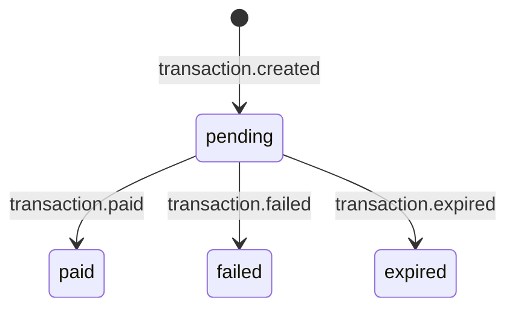

## Ciclo de vida

Uma cobrança PIX passa pelos seguintes estados, e cada transição gera um evento de webhook:



---

## `transaction.created`

Disparado assim que a cobrança é gerada via [`POST /pix/create`](/api-reference/pix-create).

```json
{
  "event": "transaction.created",
  "data": {
    "id": "683fb19a5d5de60d9bbc4e3f",
    "amount": 25000,
    "status": "pending",
    "created_at": "2026-05-10T20:30:00.000Z",
    "expires_at": "2026-05-10T21:00:00.000Z",
    "metadata": {
      "order_id": "12345"
    }
  }
}
```

<Expandable title="Campos do payload">
  <ResponseField name="data.id" type="string" required>
    ID único da transação.
  </ResponseField>

  <ResponseField name="data.amount" type="number" required>
    Valor da cobrança em centavos.
  </ResponseField>

  <ResponseField name="data.status" type="string" required>
    Sempre `"pending"`.
  </ResponseField>

  <ResponseField name="data.created_at" type="string" required>
    Data/hora ISO-8601 de criação.
  </ResponseField>

  <ResponseField name="data.expires_at" type="string" required>
    Data/hora ISO-8601 de expiração (30 minutos após criação).
  </ResponseField>

  <ResponseField name="data.metadata" type="object">
    Espelho do `metadata` enviado na criação.
  </ResponseField>
</Expandable>

---

## `transaction.paid`

Disparado quando o pagamento é confirmado pelo provedor. Este é o evento principal da integração.

```json
{
  "event": "transaction.paid",
  "data": {
    "id": "683fb19a5d5de60d9bbc4e3f",
    "amount": 25000,
    "fee": 1250,
    "net_amount": 23750,
    "status": "paid",
    "paid_at": "2026-05-10T20:32:15.000Z",
    "metadata": {
      "order_id": "12345"
    }
  }
}
```

<Expandable title="Campos do payload">
  <ResponseField name="data.id" type="string" required>
    ID único da transação.
  </ResponseField>

  <ResponseField name="data.amount" type="number" required>
    Valor **bruto** pago pelo cliente, em centavos.
  </ResponseField>

  <ResponseField name="data.fee" type="number" required>
    Taxa total retida pelo Gekko Pay, em centavos (percentual \+ fixa).
  </ResponseField>

  <ResponseField name="data.net_amount" type="number" required>
    Valor **líquido** creditado na sua conta. Fórmula: `amount - fee`.
  </ResponseField>

  <ResponseField name="data.status" type="string" required>
    Sempre `"paid"`.
  </ResponseField>

  <ResponseField name="data.paid_at" type="string" required>
    Data/hora ISO-8601 da confirmação do pagamento.
  </ResponseField>

  <ResponseField name="data.metadata" type="object">
    Espelho do `metadata` enviado na criação.
  </ResponseField>
</Expandable>

<Tip>
  Use `net_amount` para calcular o valor real creditado. Nunca assuma que `amount` é o valor que você receberá.
</Tip>

---

## `transaction.failed`

Disparado quando a transação é rejeitada ou falha no provedor de pagamento.

```json
{
  "event": "transaction.failed",
  "data": {
    "id": "683fb19a5d5de60d9bbc4e3f",
    "amount": 25000,
    "status": "failed",
    "reason": "cancelled",
    "metadata": {
      "order_id": "12345"
    }
  }
}
```

<Expandable title="Campos do payload">
  <ResponseField name="data.id" type="string" required>
    ID único da transação.
  </ResponseField>

  <ResponseField name="data.amount" type="number" required>
    Valor original da cobrança, em centavos.
  </ResponseField>

  <ResponseField name="data.status" type="string" required>
    Sempre `"failed"`.
  </ResponseField>

  <ResponseField name="data.reason" type="string" required>
    Motivo da falha. Valores comuns:

    | Reason | Descrição |
    | :-- | :-- |
    | `cancelled` | Cancelado pelo provedor. |
    | `failed` | Falha no processamento. |
    | `refunded` | Estornado pelo provedor. |
    | `chargeback` | Chargeback recebido. |
  </ResponseField>

  <ResponseField name="data.metadata" type="object">
    Espelho do `metadata` enviado na criação.
  </ResponseField>
</Expandable>

---

## `transaction.expired`

<Warning>
  Este evento será implementado em uma próxima versão. Atualmente, transações expiram silenciosamente após 30 minutos. Use [`/pix/check`](/api-reference/pix-check) para verificar.
</Warning>

Quando disponível, o payload seguirá o padrão:

```json
{
  "event": "transaction.expired",
  "data": {
    "id": "683fb19a5d5de60d9bbc4e3f",
    "amount": 25000,
    "status": "expired",
    "expired_at": "2026-05-10T21:00:00.000Z",
    "metadata": {
      "order_id": "12345"
    }
  }
}
```

<Expandable title="Campos do payload (planejado)">
  <ResponseField name="data.id" type="string" required>
    ID único da transação.
  </ResponseField>

  <ResponseField name="data.amount" type="number" required>
    Valor original da cobrança, em centavos.
  </ResponseField>

  <ResponseField name="data.status" type="string" required>
    Sempre `"expired"`.
  </ResponseField>

  <ResponseField name="data.expired_at" type="string" required>
    Data/hora ISO-8601 em que a cobrança expirou.
  </ResponseField>

  <ResponseField name="data.metadata" type="object">
    Espelho do `metadata` enviado na criação.
  </ResponseField>
</Expandable>

---

## Resumo dos campos por evento

| Campo | `created` | `paid` | `failed` | `expired` |
| :-- | :-: | :-: | :-: | :-: |
| `id` | ✅ | ✅ | ✅ | ✅ |
| `amount` | ✅ | ✅ | ✅ | ✅ |
| `status` | ✅ | ✅ | ✅ | ✅ |
| `metadata` | ✅ | ✅ | ✅ | ✅ |
| `created_at` | ✅ |  |  |  |
| `expires_at` | ✅ |  |  |  |
| `fee` |  | ✅ |  |  |
| `net_amount` |  | ✅ |  |  |
| `paid_at` |  | ✅ |  |  |
| `reason` |  |  | ✅ |  |
| `expired_at` |  |  |  | ✅ |

---

<CardGroup cols={2}>
  <Card title="Introdução" icon="book" href="/api-reference/webhooks">
    Como configurar, exemplos de código e boas práticas.
  </Card>

  <Card title="Códigos de erro" icon="triangle-exclamation" href="/api-reference/erros">
    Referência completa dos códigos de erro da API.
  </Card>
</CardGroup>